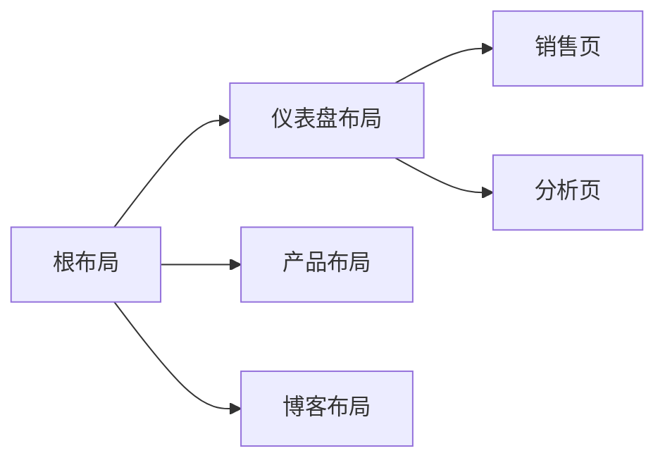

## Chapter 01: Getting Started

TypeScript

- Next.js detects if your project uses TypeScript and automatically installs the necessary packages and configuration. Next.js also comes with a TypeScript plugin for your code editor, to help with auto-completion and type-safety.

项目结构说明

- /app: all components
- /app/lib: functions(reusable utility functions )
- /app/ui: UI components
- /public: static assets
- Config: next.config.ts

```bash
┌───(c0r3dump@MacBook-Air)-[~/Works/nextjs-learning/nextjs_proj/nextjs-dashboard][mbair*]
└─$ tree -L 2
.
├── app
│   ├── layout.tsx
│   ├── lib
│   ├── page.tsx
│   ├── query
│   ├── seed
│   └── ui
├── next-env.d.ts
├── next.config.ts
├── node_modules
│   ├── @heroicons
│   ├── @tailwindcss
│   ├── @types
│   ├── autoprefixer -> .pnpm/autoprefixer@10.4.20_postcss@8.5.1/node_modules/autoprefixer
│   ├── bcrypt -> .pnpm/bcrypt@5.1.1/node_modules/bcrypt
│   ├── clsx -> .pnpm/clsx@2.1.1/node_modules/clsx
│   ├── next -> .pnpm/next@15.3.2_react-dom@19.1.0_react@19.1.0__react@19.1.0/node_modules/next
│   ├── next-auth -> .pnpm/next-auth@5.0.0-beta.25_next@15.3.2_react-dom@19.1.0_react@19.1.0__react@19.1.0__react@19.1.0/node_modules/next-auth
│   ├── postcss -> .pnpm/postcss@8.5.1/node_modules/postcss
│   ├── postgres -> .pnpm/postgres@3.4.6/node_modules/postgres
│   ├── react -> .pnpm/react@19.1.0/node_modules/react
│   ├── react-dom -> .pnpm/react-dom@19.1.0_react@19.1.0/node_modules/react-dom
│   ├── tailwindcss -> .pnpm/tailwindcss@3.4.17/node_modules/tailwindcss
│   ├── typescript -> .pnpm/typescript@5.7.3/node_modules/typescript
│   ├── use-debounce -> .pnpm/use-debounce@10.0.4_react@19.1.0/node_modules/use-debounce
│   └── zod -> .pnpm/zod@3.25.17/node_modules/zod
├── package.json
├── pnpm-lock.yaml
├── postcss.config.js
├── public
│   ├── customers
│   ├── favicon.ico
│   ├── hero-desktop.png
│   ├── hero-mobile.png
│   └── opengraph-image.png
├── README.md
├── tailwind.config.ts
└── tsconfig.json
```

运行

```bash
# install packages
pnpm i
# start server
pnpm dev
```

## Chapter 02: CSS Styling

Tailwind

> [Tailwind](https://tailwindcss.com/) is a CSS framework that speeds up the development process by allowing you to quickly write [utility classes](https://tailwindcss.com/docs/utility-first) directly in your React code.

使用`Tailwind`CSS框架进行快速CSS开发

- Tailwind classes

### `clsx` library

`clsx`可以根据不同的条件，选择不同的style

```typescript
import clsx from 'clsx';

// 可以看到这里的组件InvoiceStatus接收参数status
export default function InvoiceStatus({ status }: { status: string }) {
  return (
    <span
      className={clsx(
        'inline-flex items-center rounded-full px-2 py-1 text-sm',
        {
          'bg-gray-100 text-gray-500': status === 'pending',
          'bg-green-500 text-white': status === 'paid',
        },
      )}
    >
    // ...
)}
```

## Chapter03: Optimizing Fonts and Images

Why optimize fonts?

- Fonts play a significant role in the design of a website
- 浏览器初始用 fallback 字体或系统字体渲染文本，加载自定义字体后进行替换。**布局偏移的影响**：可能导致文本大小、间距或布局改变，使周围元素位置移动。

Next.js会自动进行字体优化

- `next/font` module

- 在构建阶段下载并托管在static assets

### Adding a primary font

So easy

Why optimize images?

- /public dir
- 代码资源引用：`src="/hero.png"`

- 自适应不同的screen size
- Lazy load
- ...

同样Next.js进行了自动优化

- `next/image` module

### `<Image>`组件

- Preventing layout shift
- Resizing images
- Lazy loading
- Support morden formats: WebP AVIF...

## Chapter 04: Creating Layouts and Pages

路由


> `page.tsx` is a special Next.js file that exports a React component, and it's required for the route to be accessible. In your application, you already have a page file: `/app/page.tsx` - this is the home page associated with the route `/`.

只有`page`文件是可以公开访问的

### Creating the dashboard layout

使用layouts，只进行部分渲染，而不整体渲染


### Root layout

/app/layout.tsx

- This is called a root layout and is required in every Next.js application
- Will be shared across all pages in your application



## Chapter 05: Navigating Between Pages

在不同的pages之间进行跳转

Why optimize navigation?

- 传统方案：使用`<a>`标签
  - 但是每次都会导致页面的full page refresh

`<Link>` component

- In Next.js, `<Link>` allows you to do client-side navigation

### Automatic code-splitting and prefetching

Pattern: Showing active links

当用户处于某个页面时，对应的导航链接应该高亮显示，以提示用户当前的位置

- Hook: usePathname(),获取当前页面的URL

## Chapter 06: Setting up Your Database

PostgreSQL database

- 开源关系型数据库
